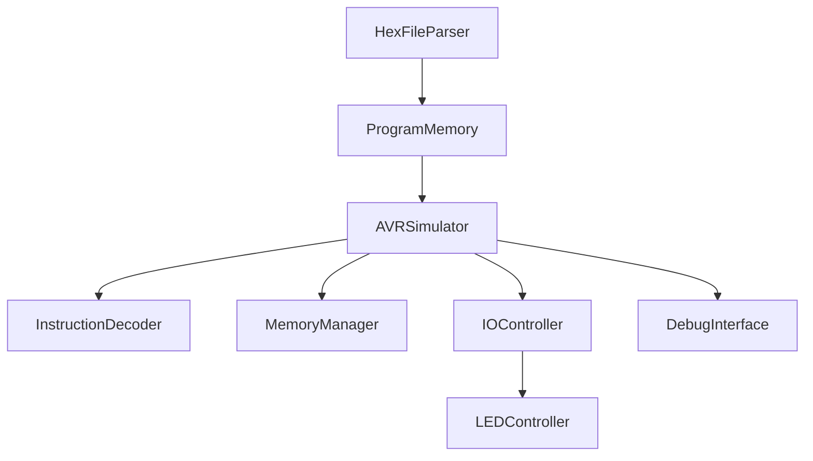

# Arduino Simulator en Unity

Un simulador completo de Arduino desarrollado en Unity que ejecuta programas reales compilados desde Arduino IDE mediante archivos .hex.


## 📋 Tabla de Contenidos

- [Características](#-características)
- [Capturas de Pantalla](#-capturas-de-pantalla)  
- [Instalación](#-instalación)
- [Uso Rápido](#-uso-rápido)
- [Arquitectura del Sistema](#-arquitectura-del-sistema)
- [Documentación Técnica](#-documentación-técnica)
- [Contribución](#-contribución)
- [Roadmap](#️-roadmap)
- [Licencia](#-licencia)

## ✨ Características

### 🎯 Simulación Completa AVR
- **Ejecución de archivos .hex reales** compilados desde Arduino IDE
- **Procesador AVR simulado** con registros, memoria y stack
- **Sistema de debugging avanzado** con visualización en tiempo real
- **Timing configurable** para diferentes velocidades de simulación

### 🔧 Funcionalidades Implementadas
- ✅ Parser completo de archivos Intel HEX
- ✅ Simulación de instrucciones AVR (LDI, OUT, SBI, CBI, RJMP, CALL, RET)
- ✅ Gestión de memoria (SRAM, EEPROM, registros I/O)
- ✅ Control visual de LEDs con efectos realistas
- ✅ Sistema de puertos I/O (PORTB, DDRB, PINB)
- ✅ Control manual y automático mediante interfaz

### 🎮 Interfaz de Usuario
- **Controles en tiempo real**: Toggle, Blink, Modo automático
- **Visualización del estado**: Registros, memoria, contador de programa
- **Debug interactivo**: Ejecución paso a paso o continua
- **Interfaz Unity integrada**: Controles GUI nativos

## 📷 Capturas de Pantalla

> **Nota**: Agrega aquí capturas de pantalla de tu simulador en funcionamiento

## 🚀 Instalación

### Prerrequisitos
- Unity 2022.3 LTS o superior
- Arduino IDE (para compilar programas .hex)
- Git (para clonar el repositorio)

### Pasos de Instalación

1. **Clona el repositorio**
   ```bash
   git clone https://github.com/tu-usuario/arduino-simulator-unity.git
   cd arduino-simulator-unity
   ```

2. **Abre en Unity**
   - Abre Unity Hub
   - Haz clic en "Add project from disk"
   - Selecciona la carpeta del proyecto clonado
   - Abre el proyecto

3. **Configura la escena**
   - Abre la escena `Assets/Scenes/ArduinoSimulator.unity`
   - Presiona Play para probar el simulador

4. **Agrega tus archivos .hex**
   - Coloca tus archivos .hex en `Assets/StreamingAssets/`
   - Configura la ruta en el componente `HexFileParser`

## 🎯 Uso Rápido

### Simulación Básica

1. **Carga un programa .hex**:
   ```csharp
   // En el inspector del HexFileParser
   Hex File Path: "sketch.hex"  // Tu archivo compilado
   Load On Start: true
   ```

2. **Controles de teclado**:
   - `ESPACIO`: Toggle LED
   - `B`: Parpadeo LED (5 veces)
   - `A`: Modo automático ON/OFF

3. **Debug avanzado**:
   - Habilita "Enable Debug" en AVRSimulator
   - Usa "Step By Step" para ejecución manual
   - Observa la ventana de debug en tiempo real

### Compilar Programa Arduino

```cpp
// Ejemplo: Blink LED (Pin 13)
void setup() {
  pinMode(13, OUTPUT);
}

void loop() {
  digitalWrite(13, HIGH);
  delay(1000);
  digitalWrite(13, LOW);
  delay(1000);
}
```

**Compilar**:
1. Arduino IDE → Sketch → Export compiled Binary
2. Copia el archivo .hex a `StreamingAssets/`
3. Ejecuta el simulador

## 🏗️ Arquitectura del Sistema

### Componentes Principales



### Flujo de Ejecución

1. **HexFileParser**: Lee y valida archivos Intel HEX
2. **AVRSimulator**: Motor principal de simulación
3. **InstructionDecoder**: Decodifica y ejecuta instrucciones AVR
4. **MemoryManager**: Gestiona SRAM, registros y EEPROM
5. **IOController**: Maneja puertos de entrada/salida
6. **LEDController**: Renderiza efectos visuales de LEDs

## 📚 Documentación Técnica

### Scripts Principales

| Script | Descripción | Responsabilidad |
|--------|-------------|-----------------|
| `AVRSimulator.cs`[1] | Motor principal del simulador | Ciclo de ejecución, debugging, control de estado |
| `HexFileParser.cs`[3] | Parser de archivos Intel HEX | Lectura, validación y carga de programas |
| `LEDController.cs`[4] | Control visual de LEDs | Efectos, animaciones, materialES emisivos |
| `ArduinoController.cs`[1] | Controlador de alto nivel | Interfaz unificada, controles manuales |
| `UIController.cs`[5] | Interfaz de usuario | Botones, sliders, indicadores de estado |

### Instrucciones AVR Soportadas

| Instrucción | Opcode | Descripción | Estado |
|-------------|---------|-------------|---------|
| `LDI` | `0xE000` | Load Immediate | ✅ Implementado |
| `OUT` | `0xB800` | Store Register to I/O | ✅ Implementado |
| `SBI` | `0x9A00` | Set Bit in I/O Register | ✅ Implementado |
| `CBI` | `0x9800` | Clear Bit in I/O Register | ✅ Implementado |
| `RJMP` | `0xC000` | Relative Jump | ✅ Implementado |
| `CALL` | `0x940E` | Call Subroutine | ✅ Implementado |
| `RET` | `0x9508` | Return from Subroutine | ✅ Implementado |

### Configuración Avanzada

```csharp
[Header("Configuración del Simulador")]
public float clockFrequency = 16000000f;  // 16 MHz
public int instructionsPerFrame = 100;    // Rendimiento
public bool enableDebug = true;           // Información debug
public bool stepByStep = false;           // Ejecución manual
```

## 🤝 Contribución

¡Las contribuciones son bienvenidas! Sigue estos pasos:

1. **Fork el proyecto**
2. **Crea una rama feature** (`git checkout -b feature/AmazingFeature`)
3. **Commit tus cambios** (`git commit -m 'Add some AmazingFeature'`)
4. **Push a la rama** (`git push origin feature/AmazingFeature`)
5. **Abre un Pull Request**

### Áreas que Necesitan Contribución

- 🔧 **Instrucciones AVR adicionales** (MUL, FMUL, BST, BLD)
- ⚡ **Sistema de interrupciones** (Timer, External, ADC)
- 🎛️ **Periféricos adicionales** (UART, SPI, I2C, ADC)
- 🐛 **Testing y QA** (Unit tests, integración)
- 📖 **Documentación** (Tutoriales, ejemplos)

## 🗺️ Roadmap

### Versión 1.1 (Próxima)
- [ ] Sistema básico de interrupciones
- [ ] Instrucciones aritméticas avanzadas
- [ ] Mejorar precisión de timing
- [ ] Breakpoints condicionales

### Versión 1.2
- [ ] Simulación de UART/Serial
- [ ] ADC para sensores analógicos
- [ ] PWM para control de servos
- [ ] I2C/SPI básico

### Versión 2.0
- [ ] Soporte múltiples placas Arduino
- [ ] Sistema de plugins
- [ ] Exportación de datos de simulación

## 📄 Licencia

Este proyecto está licenciado bajo la Licencia MIT - ver el archivo [LICENSE](LICENSE) para detalles.

## 🙋‍♂️ Soporte y Contacto

- **Autor**: [Héctor Helí Ruiz García](https://github.com/hector-heli) 
- **Issues**: [GitHub Issues](https://github.com/hector-heli/ArduSim-3D/issues)
- **Email**: hectorheli.dev@gmail.com - hh_rg@hotmail.com

## 🏆 Reconocimientos

- Comunidad Arduino por la documentación del AVR
- Unity Technologies por el motor de juego
- Contribuidores del proyecto Intel HEX format

---

⭐ **¡Si este proyecto te resulta útil, danos una estrella en GitHub!** ⭐